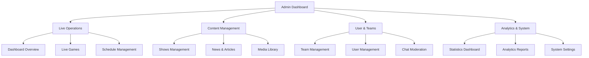
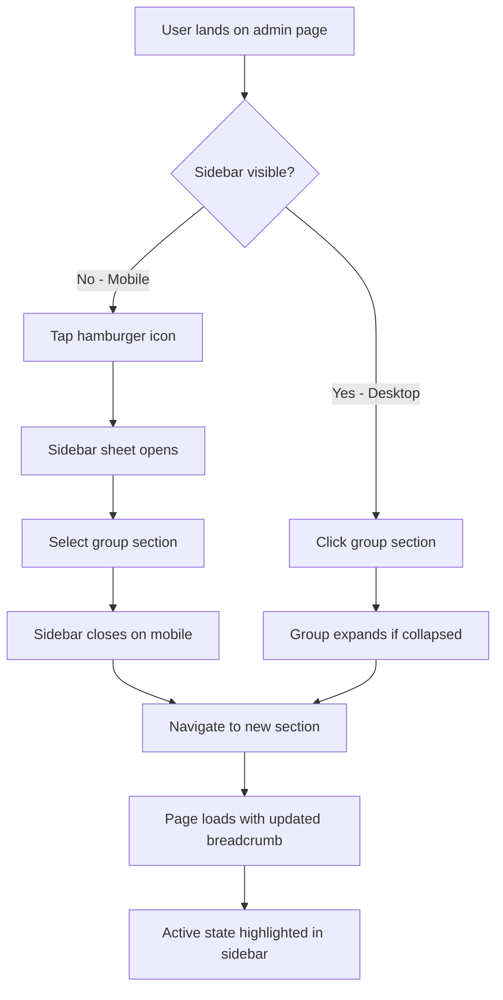
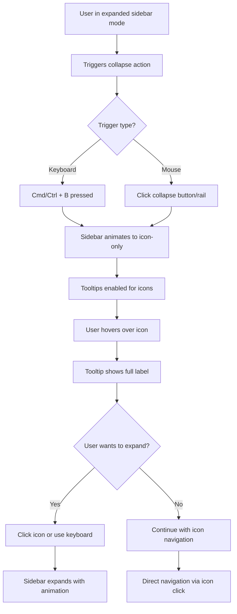

# Community Sports Network Admin Sidebar UI/UX Specification

This document defines the user experience goals, information architecture, user flows, and visual design specifications for **Community Sports Network's Admin Dashboard Sidebar**. It serves as the foundation for visual design and frontend development, ensuring a cohesive and user-centered experience.

The specification focuses on implementing a modern, collapsible sidebar navigation system using shadcn/ui components to organize admin functionality into logical groups while maintaining excellent mobile responsiveness and accessibility.

**Project Context:** Replacing the current basic admin sidebar with a comprehensive shadcn Sidebar system featuring organized groups (Live Operations, Content Management, User & Teams, Analytics & System), collapsible functionality, and professional visual hierarchy.

## Overall UX Goals & Principles

### Target User Personas
- **Sports Admin Coordinator:** Community college athletics administrators who manage multiple sports programs, need efficient access to live games, scheduling, and team information
- **Content Manager:** Staff responsible for managing shows, news, and media content across multiple sports programs
- **System Administrator:** Technical staff who need access to user management, analytics, and system settings

### Usability Goals
- **Efficiency of use:** Admin users can navigate between any two sections in 2 clicks or less
- **Cognitive load reduction:** Logical grouping reduces mental effort required to find specific functions
- **Mobile accessibility:** Important admin functions accessible on mobile devices during events
- **Consistency:** Navigation behavior follows established patterns across all admin sections

### Design Principles
1. **Organized Efficiency** - Group related functions logically to reduce navigation time
2. **Progressive Disclosure** - Show grouped navigation, expand details on demand
3. **Responsive Adaptation** - Optimize for both desktop workflows and mobile monitoring
4. **Visual Clarity** - Use modern design language that communicates hierarchy clearly
5. **Accessible by Design** - Ensure full keyboard navigation and screen reader support

### Change Log

| Date | Version | Description | Author |
|------|---------|-------------|--------|
| 2024-01-15 | 1.0 | Initial specification creation | UX Expert |

## Information Architecture (IA)

### Site Map / Screen Inventory



### Navigation Structure

**Primary Navigation:** Collapsible sidebar with 4 main groups using shadcn SidebarGroup components. Each group expands to show 3 sub-items using SidebarMenu structure. Navigation persists across all admin pages with active state highlighting.

**Secondary Navigation:** Contextual navigation within each admin page (breadcrumbs, tabs, action buttons). Uses shadcn Breadcrumb and Tabs components where appropriate.

**Breadcrumb Strategy:** Simple two-level breadcrumbs: Admin > [Current Section]. Implemented in AdminHeader component, updates based on active sidebar selection.

## User Flows

### Flow 1: Admin Navigation & Section Switching

**User Goal:** Quickly navigate between different admin functional areas while maintaining context and efficiency.

**Entry Points:** Any admin page, browser bookmark, or direct URL access to admin sections.

**Success Criteria:** User can switch between any two admin sections in 2 clicks or less, with clear visual feedback about current location.

**Flow Diagram:**


**Edge Cases & Error Handling:**
- Collapsed sidebar on desktop: Show tooltips on hover for icon-only navigation
- Network delays: Show loading state in sidebar menu items
- Deep linking: Expand appropriate sidebar group when landing on specific admin page
- Permission restrictions: Gray out or hide restricted sections based on user role

**Notes:** Flow optimized for both mobile sheet overlay and desktop collapsible behavior. Critical that active states persist across page navigation.

### Flow 2: Sidebar Collapse/Expand Interaction

**User Goal:** Maximize content viewing area when needed while maintaining quick navigation access.

**Entry Points:** Desktop admin interface with expanded sidebar visible.

**Success Criteria:** Smooth transition between expanded and icon-only modes with preserved functionality.

**Flow Diagram:**


**Edge Cases & Error Handling:**
- Animation performance: Provide reduced-motion alternative for accessibility
- Touch devices: Disable collapse on tablets, use mobile sheet instead
- Keyboard navigation: Ensure all functions accessible via Tab/Enter/Escape
- State persistence: Remember user's collapse preference across sessions

**Notes:** Desktop-only flow since mobile uses sheet overlay. Animation timing critical for smooth user experience.

## Wireframes & Mockups

**Primary Design Files:** Implementation will use shadcn/ui component library as the design system foundation. No separate design tool files needed - specifications will be code-driven using shadcn's established patterns.

### Key Screen Layouts

#### Desktop Admin Layout (Expanded Sidebar)

**Purpose:** Primary working interface for admin users with full navigation visibility and maximum content area efficiency.

**Key Elements:**
- **Sidebar (256px width):** Fixed left position with 4 collapsible groups
- **Header bar (64px height):** Contains breadcrumbs, user menu, and sidebar toggle
- **Main content area:** Flex-1 with 24px padding, scrollable
- **Group sections:** SidebarGroup components with labels and 3 menu items each

**Interaction Notes:** Sidebar groups expand/collapse independently. Active page highlighted with shadcn accent colors. Hover states on all interactive elements.

**Design File Reference:** Built using shadcn Sidebar, SidebarGroup, SidebarMenu components

#### Desktop Admin Layout (Collapsed Sidebar)

**Purpose:** Maximize content viewing area while maintaining quick navigation access through icon-only sidebar.

**Key Elements:**
- **Sidebar (48px width):** Icon-only mode with tooltips on hover
- **Content area:** Expanded to use additional 208px of screen width
- **Icons:** Lucide icons representing each section (consistent with current AdminSidebar)
- **Tooltips:** shadcn Tooltip components showing full section names

**Interaction Notes:** Click any icon to navigate directly. Hover shows tooltip with full name. Keyboard shortcut (Cmd/Ctrl+B) to expand back to full width.

**Design File Reference:** Uses shadcn Sidebar collapsible="icon" variant

#### Mobile Admin Layout (Sheet Overlay)

**Purpose:** Touch-friendly navigation that doesn't compromise mobile content viewing area.

**Key Elements:**
- **Header:** Contains hamburger menu trigger (SidebarTrigger component)
- **Sheet overlay:** Full-height drawer with navigation groups
- **Content area:** Full width when sidebar closed
- **Touch targets:** Minimum 44px height for accessibility

**Interaction Notes:** Tap hamburger to open navigation sheet. Tap outside or select item to close. Swipe-to-close gesture supported by shadcn Sheet component.

**Design File Reference:** Uses shadcn Sheet component within Sidebar mobile responsive behavior

## Component Library / Design System

**Design System Approach:** Leveraging shadcn/ui component library as the foundation, ensuring consistency with existing Community Sports Network interface patterns and Tailwind CSS utility classes.

### Core Components

#### Enhanced Sidebar System

**Purpose:** Main navigation container that adapts between desktop collapsible and mobile sheet behaviors.

**Variants:**
- `expanded` - Full width with group labels and menu text
- `collapsed` - Icon-only mode with tooltips
- `mobile` - Sheet overlay behavior on small screens

**States:**
- `default` - Standard navigation state
- `active` - Current page highlighted with accent background
- `hover` - Interactive feedback on menu items
- `loading` - Skeleton placeholders during navigation

**Usage Guidelines:** Always wrap in SidebarProvider. Use SidebarInset for main content area. Implement keyboard navigation support.

#### Navigation Group Component

**Purpose:** Organizes related admin functions into collapsible sections within the sidebar.

**Variants:**
- `live-operations` - Dashboard, Live Games, Schedule
- `content-management` - Shows, News, Media
- `user-teams` - Teams, Users, Chat Moderation  
- `analytics-system` - Statistics, Analytics, Settings

**States:**
- `expanded` - Group shows all menu items
- `collapsed` - Group shows only header (desktop only)
- `active-child` - Contains the currently active page

**Usage Guidelines:** Use SidebarGroup with SidebarGroupLabel and SidebarGroupContent. Maximum 3-4 items per group for visual balance.

#### Menu Item Component

**Purpose:** Individual navigation links within sidebar groups.

**Variants:**
- `default` - Standard menu item with icon and label
- `compact` - Icon-only when sidebar collapsed
- `mobile` - Touch-optimized sizing for mobile sheet

**States:**
- `default` - Inactive menu item
- `active` - Currently selected page
- `hover` - Mouse hover feedback
- `focus` - Keyboard focus indicator

**Usage Guidelines:** Use SidebarMenuItem with SidebarMenuButton. Include Lucide React icons. Implement proper ARIA labels for screen readers.

## Branding & Style Guide (Soft Pop Theme)

### Visual Identity

**Brand Guidelines:** Using the **Soft Pop** shadcn theme for a modern, vibrant admin interface that maintains professional usability while adding visual interest through carefully crafted color harmony.

### Color Palette (Soft Pop Theme)

| Color Type | Light Mode | Dark Mode | Usage |
|------------|------------|-----------|--------|
| Primary | `oklch(0.5106 0.2301 276.9656)` | `oklch(0.6801 0.1583 276.9349)` | Active navigation, primary buttons |
| Secondary | `oklch(0.7038 0.1230 182.5025)` | `oklch(0.7845 0.1325 181.9120)` | Group headers, secondary actions |
| Accent | `oklch(0.7686 0.1647 70.0804)` | `oklch(0.8790 0.1534 91.6054)` | Hover states, focus indicators |
| Background | `oklch(0.9789 0.0082 121.6272)` | `oklch(0 0 0)` | Main background, sidebar background |
| Destructive | `oklch(0.6368 0.2078 25.3313)` | `oklch(0.7106 0.1661 22.2162)` | Error states, destructive actions |
| Success | `oklch(0.7323 0.2492 142.4953)` | `oklch(0.7323 0.2492 142.4953)` | Positive feedback, live indicators |

### Typography (Soft Pop Theme)

#### Font Families
- **Primary:** `DM Sans, sans-serif` (Clean, modern sans-serif)
- **Secondary:** `DM Sans, sans-serif` (Consistent throughout)
- **Monospace:** `Space Mono, monospace` (Technical data, code snippets)

#### Type Scale

| Element | Size | Weight | Line Height |
|---------|------|---------|-------------|
| H1 | `2.25rem` | `700` | `1.2` |
| H2 | `1.875rem` | `600` | `1.3` |
| H3 | `1.5rem` | `600` | `1.4` |
| Body | `0.875rem` | `400` | `1.5` |
| Small | `0.75rem` | `400` | `1.4` |

### Iconography

**Icon Library:** Lucide React icons with Soft Pop theme color integration

**Usage Guidelines:** 
- Standard size: `1rem` (16px) for sidebar menu items
- Primary color for active states: `oklch(0.5106 0.2301 276.9656)`
- Accent color for hover states: `oklch(0.7686 0.1647 70.0804)`
- Consistent with shadcn Button and other component icon sizing

### Spacing & Layout (Soft Pop Theme)

**Grid System:** CSS Grid and Flexbox with `1rem` border radius throughout

**Spacing Scale:** 
- Border radius: `1rem` for all components (cards, buttons, sidebar groups)
- Standard spacing using Tailwind's scale
- Letter spacing: Normal (0em)

**Shadow System:**
- Subtle shadows from 2xs to 2xl range
- Used for sidebar depth and component elevation
- Consistent with Soft Pop's refined shadow approach

**Theme Implementation Command:**
```bash
pnpm dlx shadcn@latest add https://tweakcn.com/r/themes/soft-pop.json
```

## Accessibility Requirements

### Compliance Target

**Standard:** WCAG 2.1 AA compliance for all sidebar navigation components and interactions.

### Key Requirements

**Visual:**
- Color contrast ratios: Minimum 4.5:1 for normal text, 3:1 for large text and interactive elements
- Focus indicators: Visible 2px outline using `hsl(var(--ring))` color on keyboard focus
- Text sizing: Support browser zoom up to 200% without horizontal scrolling

**Interaction:**
- Keyboard navigation: Full functionality accessible via Tab, Enter, Escape, and Arrow keys
- Screen reader support: Proper ARIA labels, roles, and state announcements for all interactive elements
- Touch targets: Minimum 44x44px touch areas on mobile devices

**Content:**
- Alternative text: Descriptive ARIA labels for all navigation icons
- Heading structure: Proper semantic heading hierarchy (screen readers only)
- Form labels: Clear association between triggers and expanded content

### Testing Strategy

Automated testing with axe-core, manual keyboard navigation testing, and screen reader validation using VoiceOver (macOS) and NVDA (Windows). Focus management testing during sidebar state changes and mobile sheet interactions.

## Responsiveness Strategy

### Breakpoints

| Breakpoint | Min Width | Max Width | Target Devices |
|------------|-----------|-----------|----------------|
| Mobile | `0px` | `767px` | Smartphones, small tablets |
| Tablet | `768px` | `1023px` | Tablets, small laptops |
| Desktop | `1024px` | `1439px` | Laptops, standard monitors |
| Wide | `1440px` | `-` | Large monitors, ultrawide displays |

### Adaptation Patterns

**Layout Changes:** 
- Mobile (0-767px): Full-width content with sheet overlay navigation
- Tablet (768-1023px): Standard sidebar behavior with touch-optimized targets
- Desktop (1024px+): Full sidebar functionality with collapse capability
- Wide (1440px+): Sidebar maintains fixed width, content area expands

**Navigation Changes:**
- Mobile: Hamburger trigger → Sheet overlay → Touch-friendly menu items (44px min height)
- Tablet: Standard sidebar with expanded touch targets, no collapse feature
- Desktop: Full collapse/expand functionality with keyboard shortcuts and hover tooltips
- Wide: Same as desktop, optimized for mouse precision

**Content Priority:**
- Mobile: Navigation hidden by default, content takes full viewport width
- Tablet: Sidebar visible, content area maintains comfortable reading width
- Desktop: Balanced sidebar/content ratio with user-controlled collapse
- Wide: Content area expands to utilize additional screen real estate

**Interaction Changes:**
- Mobile: Touch gestures (tap, swipe-to-close), sheet overlay interactions
- Tablet: Touch-optimized but with desktop-like sidebar behavior
- Desktop: Mouse hover states, keyboard shortcuts, precise click targets
- Wide: Enhanced hover effects, optimized for mouse interaction patterns

## Animation & Micro-interactions

### Motion Principles

**Smooth and Purposeful:** All animations serve functional purposes - guiding attention, providing feedback, or communicating state changes. Timing follows shadcn's built-in animation curves for consistency.

**Performance-First:** CSS transforms and opacity changes only, avoiding layout thrash. Respects `prefers-reduced-motion` for accessibility.

**Brand-Consistent:** Animation timing and easing align with Soft Pop theme's refined, modern aesthetic.

### Key Animations

- **Sidebar Collapse/Expand:** Smooth width transition (Duration: `200ms`, Easing: `ease-in-out`)
- **Group Expand/Collapse:** Height animation with opacity fade (Duration: `150ms`, Easing: `ease-out`)
- **Mobile Sheet:** Slide-in from left with backdrop fade (Duration: `300ms`, Easing: `ease-out`)
- **Menu Item Hover:** Background color transition (Duration: `150ms`, Easing: `ease-in-out`)
- **Active State:** Accent color fade-in (Duration: `200ms`, Easing: `ease-out`)
- **Focus Indicators:** Ring appearance (Duration: `100ms`, Easing: `ease-out`)
- **Tooltip Display:** Opacity and scale animation (Duration: `200ms`, Easing: `ease-in-out`)

## Performance Considerations

### Performance Goals

- **Initial Render:** Sidebar visible within first paint (<100ms)
- **Navigation Response:** Page transitions under 200ms
- **Animation FPS:** Maintain 60fps for all sidebar animations

### Design Strategies

**Lazy Loading:** Navigation icons loaded immediately, secondary assets loaded on interaction. Group content rendered on-demand when expanded.

**Animation Optimization:** Use CSS transforms and opacity only. Implement `will-change` property for active animations. Provide reduced-motion alternatives.

**State Management:** Minimize re-renders using React.memo for navigation components. Cache active states to prevent unnecessary DOM updates.

**Bundle Optimization:** Import only required shadcn components. Use tree-shaking for Lucide icons.

## Next Steps

### Immediate Actions

1. **Install Soft Pop Theme:** Run `pnpm dlx shadcn@latest add https://tweakcn.com/r/themes/soft-pop.json` to apply the theme
2. **Review Specification:** Stakeholder review of complete UI/UX specification document
3. **Technical Architecture Planning:** Collaborate with development team on shadcn Sidebar integration approach
4. **Component Inventory Audit:** Verify all required shadcn components are available and compatible
5. **Accessibility Testing Setup:** Prepare testing environment with screen readers and keyboard navigation tools

### Design Handoff Checklist

- [x] All user flows documented (Navigation & Collapse flows)
- [x] Component inventory complete (Sidebar, Groups, Menu Items)  
- [x] Accessibility requirements defined (WCAG 2.1 AA compliance)
- [x] Responsive strategy clear (Mobile sheet, Desktop collapse, Tablet standard)
- [x] Brand guidelines incorporated (Soft Pop theme specifications)
- [x] Performance goals established (Sub-200ms interactions, 60fps animations)

### Implementation Priority

**Phase 1:** Core shadcn Sidebar structure with Soft Pop theme
**Phase 2:** Group organization and navigation logic  
**Phase 3:** Responsive behavior and mobile sheet implementation
**Phase 4:** Animation polish and accessibility testing
**Phase 5:** Performance optimization and user acceptance testing

## Final Document Summary

This comprehensive UI/UX specification provides everything needed to implement a modern, accessible, and performant admin sidebar for the Community Sports Network platform. The specification leverages:

- **shadcn/ui component library** for consistent, accessible components
- **Soft Pop theme** for modern visual appeal with professional usability
- **Organized information architecture** with 4 logical navigation groups
- **Comprehensive responsiveness** from mobile sheet to desktop collapse functionality
- **WCAG 2.1 AA accessibility** ensuring inclusive admin experience
- **Performance-optimized animations** maintaining smooth 60fps interactions

The sidebar will transform the admin experience from a basic navigation list to a sophisticated, user-friendly interface that scales beautifully across all devices while maintaining the efficiency admin users require.